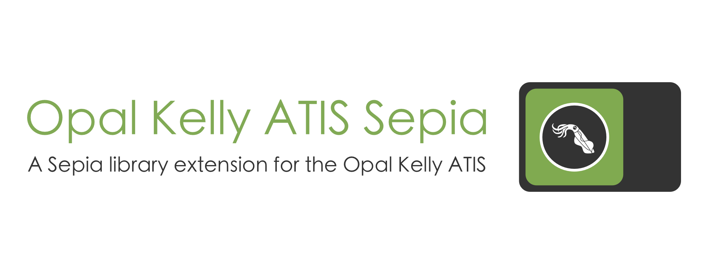

Opal Kelly ATIS Sepia is an extension to the [Sepia](https://github.com/neuromorphic-paris/sepia) library to read events from an ATIS with an Opal Kelly shield.

# Install

Within a Git repository, run the commands:

```sh
mkdir -p third_party
cd third_party
git submodule add https://github.com/neuromorphic-paris/opal_kelly_atis_sepia.git
cd ..
sh install.sh
```

The last command requires a direct connection to the Vision Institute local network, since it downloads close-source libraries.

# User guides and documentation

User guides and code documentation are held in the [wiki](https://github.com/neuromorphic-paris/opalKellyAtisSepia/wiki).

# Contribute

## Development dependencies

Opal Kelly ATIS Sepia relies on [Premake 4.x](https://github.com/premake/premake-4.x) (x ≥ 3) to generate build configurations. Follow these steps to install it:
  - __Debian / Ubuntu__: Open a terminal and execute the command `sudo apt-get install premake4`.
  - __OS X__: Open a terminal and execute the command `brew install premake`. If the command is not found, you need to install Homebrew first with the command<br />
  `ruby -e "$(curl -fsSL https://raw.githubusercontent.com/Homebrew/install/master/install)"`.

[ClangFormat](https://clang.llvm.org/docs/ClangFormat.html) is used to unify coding styles. Follow these steps to install it:
- __Debian / Ubuntu__: Open a terminal and execute the command `sudo apt-get install clang-format`.
- __OS X__: Open a terminal and execute the command `brew install clang-format`. If the command is not found, you need to install Homebrew first with the command<br />
`ruby -e "$(curl -fsSL https://raw.githubusercontent.com/Homebrew/install/master/install)"`.

## Test

To test the library, run from the *opal_kelly_atis_sepia* directory:
```sh
premake4 gmake
cd build
make
cd release
./opal_kelly_atis_sepia
```

After changing the code, format the source files by running from the *opal_kelly_atis_sepia* directory:
```sh
clang-format -i source/opal_kelly_atis_sepia.hpp
clang-format -i test/opal_kelly_atis_sepia.cpp
```

# License

See the [LICENSE](LICENSE.txt) file for license rights and limitations (GNU GPLv3).
